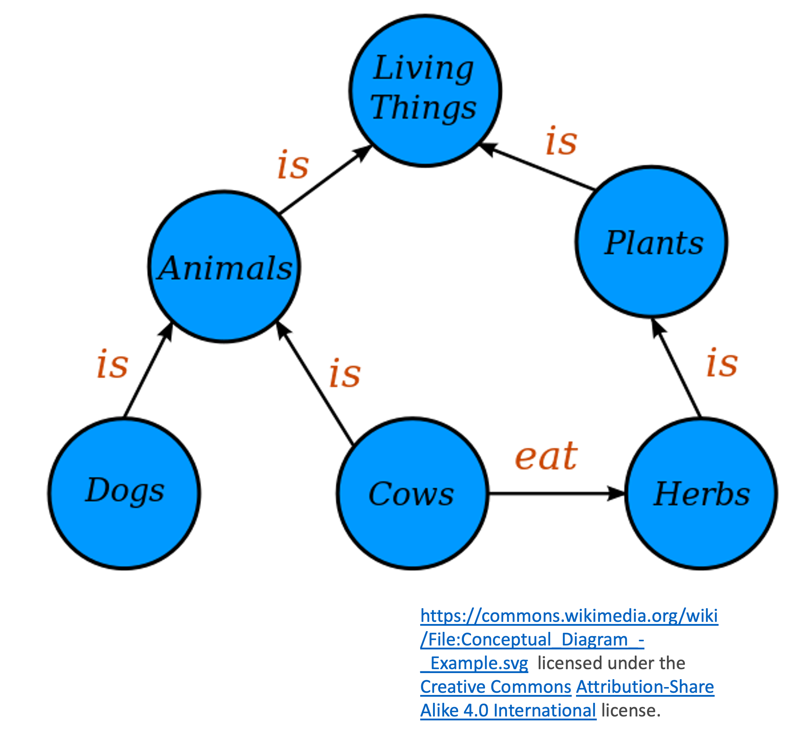

# Knowledge Graphs

Knowledge bases rooted in logic provide us with a powerful mechanism for representing and reasoning about our knowledge of the world. It provides us with theoretically sound and robust tools for querying our knowledge, is readily and easily updated, is human-readable (at least in principle), and, importantly, provides us with mechanisms for producing new sentences and thus deriving new knowledge using techniques such as forward chaining.

However, knowledge bases are not a panacea. They are difficult to construct, requiring extensive input from subject matter experts to ensure that the logical formulation really does correspond to the knowledge that is being encoded. They do not scale well, and there are no "types" or annotations to support interpretability. The relationships in knowledge bases are also represented in a way that is not especially transparent (Kanren, as we saw, includes special mechanisms for representing relations). These limitations make knowledge bases of limited use for large-scale applications. 

Practical, scalable information retrieval systems benefit from having certain properties that can require some significant contortions to add to a logic-based knowledge base. These include:

* Explicit modelling of relationships between entities.
* Annotation of entities with additional information.
* Scalable to large numbers of entities.
* Highly parallel querying.
* Online updating.
* Readable by machines.
* Interpretable by humans.

One type of system designed with these goals in mind is the **knowledge graph**. Consider the following rule-based system:

* If $x$ is a dog then $x$ is an animal.
* If $x$ is a cow then $x$ is an animal.
* If $x$ is an animal then $x$ is a living thing.
* If $x$ is a cow then $x$ eats herbs.
* If $x$ is a herb then $x$ is a plant.
* If $x$ is a plant then $x$ is a living thing.

We have seen how such a set of rules can be translated into a graphical model. Construct the model for this example and think about whether it truly represents the semantics. What is it missing?

## What is a Knowledge Graph?

A knowledge graph is a knowledge base structured as a graph. It is similar to the graphs we drew to represent rule-based systems but with some very important differences. The key features are:

* Nodes in the graph represent "things" (entities).
* Edges in graph represent relationships between the entities.
* Nodes and Edges can have a *type* that specified the nature of the entity or relationship.
* Structure is governed by a "grammar" or *schema*/*ontology*.
* Nodes and Edges can have attributes (properties).
* The graph is properly normalised, with each entity and relationship represented only once.
* The graph is explicit and declarative, and has intrinsic meaning.
* Readable by both humans and machines.
* Scales efficiently, often to millions of nodes.

An example of a simple knowledge graph is shown below. 

We can see how this model the relationships between different entities. This defines a *schema* or *ontology* that is used to specific a grammar for graphs representing individuals (eg a specific species of dog).

