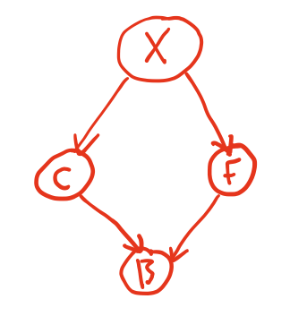

# Bayesian Networks

We have previously established that we can write a joint distribution as a product of conditional probabilities. In our specific example, which we will continue in this section, we showed that we could write

$P(G,M,F,P) = P(P\vert M)P(F\vert M)P(M)P(G)$

Why is this useful and desirable? There are three substantive reasons.

1. The number of parameters needed to characterise the distribution is much reduced. The full joint distribution requires, in this case, fifteen independent parameters (with the sixteenth being set by the normalisation constraint). Our factorised distribution can be characterised by just six parameters: $P(M)$ and $P(G)$ require one parameter each (with the second following for normalisation); $P(P\vert M)$ and $P(F\vert M)$ require two parameters each, with the others following from normalisation. This makes little difference here, but for problems involving many more variables, or where the variables have many more possible values then this can be a major issue, particularly when performing inference because of the challenges of sampling from these distributions. 

2. It is rarely possible, in real problems, to measure the joint distribution directly. In most practical situations we may observe a small number of variables whilst controlling the others. Factorisation of the joint distribution in terms of things that we can observe may, some circumstance be important if not necessarily optimal.

3. Because the factorisation reflects the structure of the **causal relationships** in the problem. In our example, the factorisation reflects that studying Geography does not influence either study of Mathematics, or careers in finance or programming; it reflects that those careers *do* depend on having studies Mathematics; and it reflects that careers in programming and finance are conditionally independent of each other.

The first two reasons are practical, pragmatic reasons why this factorisation is useful. The third, however, is much more powerful because it allows us to capture and model probabilistic problems in a very natural and interpretable way. Factorisations of this type that leverage the independence and conditional independence relationships to represent a world probabilistically are called **Bayesian networks**.

## Formal definition of a Bayesian Network

So what is a Bayesian network, technically? It is a representation of a suitably factorised probability distribution as a *directed graph* in which

1. Each node represents a single random variable (discrete or continuous)
2. Edges between node represent conditional relationships and are directed from the "conditioner" (or *parent*) node to the "conditioned" node
3. Each node has an associated conditional probability distribution with the variable associated with the node conditioned on it "parents"/
4. "Orphan" nodes with no parents represent variables that are unconditionally independent.
5. The graph must be strictly acyclic: it is a **directed acyclic graph** (DAG).

What does such a graph look like? For our current example,
* There are four nodes corresponding to random variables $G$, $M$, $F$, and $P$.
* $G$ and $M$ and unconditionally independent and are this "orphan" nodes.
* $P$ and $F$ are conditioned on $M$ only.

We therefore draw the following DAG:

The DAG naturally and visually conveys the structure and relationships within the factorised joint distribution. The isolation of $G$ reflects its statistical independence and lack of influence on any other variables, while $M$'s lack of parents indicates that it is unconditionally independent but the outgoing arrows reflect its influence on other variables: $M$ has a *causative* influence on $P$ and $F$.

Each node of this graph has associated with it a probability distribution as shown in the figure below.

This graph was, in a sense, known to us and was derived from the joint probability distribution. This was not by chance - in fact the joint probability was generated from the conditionally factorised form. In general we will not of course know the joint distribution, and in any case it would be very hard to uncover the various dependencies/independencies if we did not know what we were looking for. Most commonly, we will be posed with a problem and we will be looking to construct a Bayesian network such that the resulting joint distribution represented the given problem domain well and efficiently. Let us now set out a procedure for doing just that.

## A method for constructing Bayesian Networks

Let us being by reminding ourselve of our conditional factorisation of the joint distribution.

$ P(x_1,\dots,x_N) = \prod_{i=1}^N P(x_i\vert x_{i-1},\dots,x_1)$.

(notice the notation - this refers to specific values of the random variables)

This is called the **chain rule**. It requires an ordering to be imposed on the random variables and we will suggestively write as a shorthand that

$P(X_i\vert X_{i-1},\dots,X_1) = P(X_i\vert\mathrm{parents}(X_i)$

where $\mathrm{parents}(X_i)$ are a subset of ${X_{i-1},\dots,X_1}$. We can do this very simply in the graph by making sure that the nodes are appropriate ordered such that those nodes that are closer to the start of the DAG and have no incoming edges are lower in number that those with incoming edges. The question is, how to acheive this?

The Chain rule implies that a Bayesian network properly represents its domain if each node is conditionally independent of its predecessors in the ordering, given its parents. Here is a procedure for acheiving this:

1. Choose the variables needed to model the domain and order them. A good order has causes preceding effects and this will lead for a more compact representation.

2. For each node, choose a set of parents such that the chain rule is satisfied and that the parents can plausibly represent causes of the node's effect.

3. Add edges directed from parents to the node.

4. Write down a conditional probability table for the node.

Let's work through a simple example. Consider a situation in which 

* Fire brigade called
* Cat stuck in tree
* House on fire
* Explosion in kitchen

How would you order this? Well, let's think about what the causative chain of events might be.

* We may call the fire brigade because of a fire, or because of a stuck cat.
* The explosion in the kitchen could cause the fire, and might also have scared the cat.

We would therefore place the explosion first, followed by the cat and the fire in either order with the explosion as it's parent, and then the fire brigade as the final node.

Can we ascribe some rough probabilities to these events? Let's say there is a 5% chance of a kitchen explosion $X$,

| $P(X)$ | $P(\lnot X)$ |
|:------:|:------------:|
| 0.05   | 0.95         |

If there was a kitchen explosion, there is a high chance the cat might climb a tree ($C$). There is a reduced (but non-zero) probability that they might climb a tree anyway...

|    | $P(C)$ | $P(\lnot C)$ |
|---:|:------:|:------------:|
| $X$| 0.85   |  0.15        |
| $\lnot X$| 0.40   |  0.60   |

If there was an explosion, the chances of a fire $F$ are higher than if there weren't a fire.

|    | $P(F)$ | $P(\lnot F)$ |
|---:|:------:|:------------:|
| $X$| 0.65   |  0.35        |
| $\lnot X$| 0.10   |  0.90   |

And finally we need the probabilities of the fire brigade ($B$) being called for each combination of cat/fire.

|                  | $P(B)$ | $P(\lnot B)$ |
|-----------------:|:------:|:------------:|
| $C,F$            | 0.99   |  0.01        |
| $C,\lnot F$      | 0.6    |  0.40        |
| $\lnot C,F$      | 0.85   |  0.15        |
| $\lnot C,\lnot F$| 0.01   |  0.99        |

